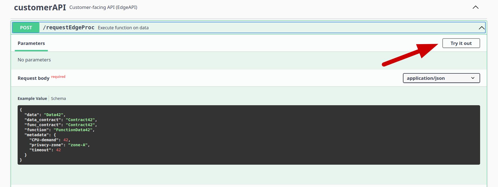

# Edge computing — AI processing BB

The *Edge Computing (Decentralized AI processing) BB* (BB-02) provides value-added services
exploiting an underlying distributed edge-computing infrastructure (e.g., owned and operated
by Cloud Providers).

These services target two main high-level goals:

- **Privacy-preserving**, where data is kept close to the user, more exactly within a pre-defined
  privacy zone.
- **Efficient near-data processing**, with optimized performance and resource utilization.

In general, the main goal is to move (AI) processing functions close to the data source
and execute them on-site. If the execution capability is available on-site, that is, in the
virtual/physical node storing the data, the data-consuming software function (as a FaaS-based
operation) or container (as a CaaS based operation) is launched there (e.g., by a
Kubernetes-based orchestration framework). Thus, we can avoid the transmission of a large
number of data and address privacy challenges designated by geographical or provider-related
rules and demands.

As a more realistic scenario, the data can also be moved for processing but only within a
pre-defined **privacy zone**. This privacy zone primarily encompasses a set of worker nodes
(using the Kubernetes terminology), that are suitable in the sense of pre-defined privacy
rules and where processing functions can and should be deployed on demand.

## Table of Contents

<!-- TOC -->
* [Edge computing — AI processing BB](#edge-computing--ai-processing-bb)
  * [Table of Contents](#table-of-contents)
  * [Design Document](#design-document)
  * [Building Instructions](#building-instructions)
    * [Production](#production)
    * [Development & Testing](#development--testing)
  * [Running Instructions](#running-instructions)
  * [Example Usage](#example-usage)
      * [REST-API](#rest-api)
      * [Testing](#testing)
      * [Examples](#examples)
  * [Test Definitions](#test-definitions)
  * [Unit Testing](#unit-testing)
    * [Setup Test Environment](#setup-test-environment)
    * [Run Tests](#run-tests)
    * [Expected Results](#expected-results)
  * [Component-Level Testing](#component-level-testing)
    * [Setup Test Environment](#setup-test-environment-1)
    * [Run Tests](#run-tests-1)
    * [Expected Results](#expected-results-1)
<!-- TOC -->

## Design Document

See the comprehensive design document [here](docs/design-document.md).

Since the functionalities of the Edge Computing BB fundamentally rely on the **Kubernetes** (K8s)
container orchestration platform (realistically spanning multiple providers' domains/clouds),
its value-added services are implemented as standalone software containers, operated in a
dedicated Kubernetes namespace, and several PTX-tailored extensions of the Kubernetes framework itself.

The elements of the BB-02's main functionality cover the following:

- Provide a _generic runtime environment_ for data-processing functions.
- Provide the ability to deploy _pre-built containers with privacy-preserving_ options.
- Provide the capability of managing and orchestrating by _privacy-zone_ labels.
- Use the _PTX Connector_ to interact with PTX core elements.
- Implement and control the process of getting data for _data consumer functions/software_.
- Implement a separate _REST-API interface_ for the integration with PTX dataspace.

See the detailed Kubernetes-based architecture and their component binding to the main
design document in
[kubernetes/design](kubernetes/design) folder.


*Binding of BB-02 components to K8s features.*

## Building Instructions

### Production

Since BB-02 is basically a set of extensions to the Kubernetes framework, instead of
standalone containerized software modules, its installation and setup require different
steps, and most of all, an operating **vanilla Kubernetes cluster** as a prerequisite.

There are many methods and tools for setting up a production-grade Kubernetes cluster on
a local machine, see, for example, the Kubernetes'
[official documentation](https://kubernetes.io/docs/setup/), or pick any of the numerous
[certified platforms](https://kubernetes.io/docs/setup/production-environment/turnkey-solutions/)
or managed cloud services available online.

The installation and configuration steps are grouped together into separate helper scripts
with a dedicated [Makefile](Makefile), which is intended to use Kubernetes packages
called [Helm charts](https://helm.sh/) internally.

To install the dependencies and the **ptx-edge extension** assuming a default `kubectl`
profile for a running Kubernetes cluster, use the following instruction:

```bash
$ make setup
```

> [!IMPORTANT]
>
> Since BB-02 is still <ins>**under development**</ins>, Makefile targets
> (_setup_ / _run_ / _cleanup_) point directly to the targets of the latest
> test level's Makefile in `kubernetes/test/levels`!

> [!NOTE]
>
> The configured level based on the `ptx-edge`-internal
> [definitions](kubernetes/test/README.md#overview) is **Level 3**.

Helper scripts can be executed directly:

```bash
$ # TBD
```

while necessary resources/dependencies and `ptx-edge` Helm charts can be
installed manually as well:

```bash
$ # TBD
```

### Development & Testing

> [!NOTE]
>
> The BB-02 module is unique in that sense that it cannot be seamlessly run by a
> container framework, such as Docker or Podman, as it is inherently based on container
> orchestration features of a higher architecture level, namely the **Kubernetes** framework.

However, for development and testing purposes, full-fledged but lightweight clusters of
different Kubernetes distributions can be set up on the fly even in a single virtual machine.

For example, the [kind](https://kind.sigs.k8s.io/), [k3d](https://k3d.io/stable/), and
[minikube](https://minikube.sigs.k8s.io/docs/) tools
are purposefully designed for creating and spinning up local, *multi-node* K8s
clusters/sandboxes using `docker` with little hassle and resource usage.
These are meant for developers to test Kubernetes distributions on their (isolated)
development machine, but are also suitable for local development, CI, and testing.

The K8s control plane and worker nodes are created as **separate docker containers** based
on specially built docker images, which

- are capable of running arbitrary software modules as preloaded docker images using
  **docker-in-docker**,
- run standard K8s distribution components, e.g., `kubelet`,
- that can be configured via the standard `kubectl` tool from the host machine.

See a detailed description of these tools, their installation and configuration on an
Ubuntu 22.04/24.04 VM in [kubernetes/test](kubernetes/test/README.md).

Nevertheless, the `ptx-edge` extension's *customer-facing API* can also be separately run
in a single container as a mockup for integration test cases.

See further about Docker-based testing

- in the *Level 1* testing setup [here](kubernetes/test/levels/level1/Makefile)
  with the related [README.md](kubernetes/test/README.md#level-1-testing-mock-api-in-single-docker-image)
- or in the mockup REST-API [README.md](kubernetes/test/mock-api/README.md)
  in `kubernetes/test/mock-api`.

## Running Instructions

To start `ptx-edge` components, run

```bash
make run
```

while tearing down the components, execute

```bash
make cleanup
```

> [!IMPORTANT]
>
> Since BB-02 is still <ins>**under development**</ins>, Makefile targets
> (_setup_ / _run_ / _cleanup_) point directly to the targets of the latest
> test level's Makefile in `kubernetes/test/levels`!

The installed _Helm chart_ launches the included `ptx-edge` services automatically,
but it does not wait until all the resources are running before it exits!

To check the current status of the installed chart's components, use the following
command:

```bash
$ # TBD
```

To keep track of a release's state, or to re-read configuration information, you can
use

```bash
$ # TBD
```

## Example Usage

The `ptx-edge` K8s extension provides a separate _REST-API_ in
[kubernetes/src/rest-api](kubernetes/src/rest-api)
to integrate its features with the PTX core components.

The API uses the [FastAPI](https://fastapi.tiangolo.com/) Python package to implement
its endpoints and also define the related OpenAPI3.1 specification directly from the
Python software code.

#### REST-API

- The REST-API uses the following base URL: ``http://<service_name>:8080/ptx-edge/v1/``.
- The interactive API interface (**Swagger UI**) lives here: ``http://<service_name>:8080/ptx-edge/v1/ui/``
- The OpenAPI specification is available at ``http://<service_name>:8080/ptx-edge/v1/openapi.json``

Additionally, the latest OpenAPI specification is auto-generated and updated at every commit
and can be found [here](kubernetes/src/rest-api/spec/openapi.yaml).

#### Testing

For testing purposes, a mock-API is generated based on the BB-02's predefined
[OpenAPI specification](kubernetes/test/mock-api/swagger_server/swagger/swagger.yaml).

The detailed description of the mock-API and its internal test cases can be found
in the related [Readme](kubernetes/test/mock-api/README.md).

The REST-API endpoints can be easily tested in the following two approaches:

- Calling directly on the specific endpoint using e.g., ``curl`` and Python's ``json`` module.\
  For example, the standalone [mock REST-API](kubernetes/test/mock-api/README.md)
  can be tested with the following command:

```bash
$ curl -sX 'GET' \
       -H 'accept: application/json' \
       'http://localhost:8080/ptx-edge/v1/version' | python3 -m json.tool
{
    "api": "0.1",
    "framework": "1.1.4"
}
```

- Manually testing endpoints with in-line test data on its
  [Swagger UI](kubernetes/test/README.md#rest-api-mockup).



> [!IMPORTANT]
>
> The different `ptx-edge` setups along with the included REST-API service
> may be exposed on different port(s) (e.g., **80**, **8080**, **443**) according
> to the applied (test/dev/prod) K8s setup, used (cloud) load balancer,
> or test VM configuration!
> Refer to the exposed port number in the related documentation!

#### Examples

The following table contains example API calls with successful results.

Further test cases for incorrect input data and other failures are collected in the
mock-APIs unit tests in
[kubernetes/test/mock-api/swagger_server/test/](kubernetes/test/mock-api/swagger_server/test).

To validate the endpoints, send the following requests to the main REST-API using the URL:
``http://<service_name>:8080/ptx-edge/v1/<endpoint>``.

| Endpoint                | HTTP verb | Example input (JSON)                                                                                                                                                                                                                                                                                              | Response Code | Example output (JSON)                                                                                                                                                                            |
|-------------------------|:---------:|-------------------------------------------------------------------------------------------------------------------------------------------------------------------------------------------------------------------------------------------------------------------------------------------------------------------|:-------------:|--------------------------------------------------------------------------------------------------------------------------------------------------------------------------------------------------|
| /versions               |    GET    | -                                                                                                                                                                                                                                                                                                                 |      200      | <pre>{"api": "0.1",<br/> "framework": "1.1.4"}</pre>                                                                                                                                             |
| /requestEdgeProc        |   POST    | <pre>{"data": "Data42",<br/> "data_contract": "Contract42",<br/> "func_contract": "Contract42",<br/> "function": "FunctionData42",<br/> "metadata":<br/>     {"CPU-demand": 42,<br/>      "privacy-zone": "zone-A",<br/>      "timeout": 42}</pre>                                                                |      202      | <pre>{"data": "Data42",<br/> "function": "FunctionData42",<br/> "metrics":<br/>     {"elapsed_time": 2,<br/>      "ret": 0},<br/> "uuid": "e09270d1-2760-4fba-b15a-255a9983ddd6"}</pre>          |
| /requestPrivacyEdgeProc |   POST    | <pre>{"consent": "Consent42",<br/> "data_contract": "Contract42",<br/> "func_contract": "Contract42",<br/> "function": "FunctionData42",<br/> "metadata":<br/>     {"CPU-demand": 42,<br/>      "privacy-zone": "zone-A",<br/>      "timeout": 42},<br/> "private_data": "Data42",<br/> "token": "Token42"}</pre> |      202      | <pre>{"function": "FunctionData42",<br/> "metrics":<br/>     {"elapsed_time": 10,<br/>      "ret": 0},<br/> "private_data": "Data42",<br/> "uuid": "a62e865c-a13d-475e-acc1-bce4ff3be66c"}</pre> |

## Test Definitions

Detailed test definitions can be found in [kubernetes/test/cases](kubernetes/test/cases/README.md).

## Unit Testing

Unit tests are based on (Python) module tests separately defined under `kubernetes/src/<module>/tests`
for each `ptx-edge` subcomponent `<module>`.

### Setup Test Environment

For installing test dependencies of a given submodule in `kubernetes/src`, refer to the related README file.

Each subproject defines a **Makefile** to unify the development/test environment creation.
Accordingly, test environment configuration (and execution) is implicitly managed by
external tools and third-party libraries, such as
[virtualenv](https://virtualenv.pypa.io/en/latest/),
[pytest](https://docs.pytest.org/en/stable/),
[nosetests](https://nose.readthedocs.io/en/latest/index.html), and
[tox](https://tox.wiki/en/4.24.1/), within these Makefiles.

Therefore, in general, there is no need for explicit environment setup as it is
automatically configured and managed by wrapper tools/scripts.

However, to explicitly set up the test/dev environment for a `<module>` locally
(without Docker), the following command can be used:

```bash
$ cd kubernetes/src/<module> && make setup
```

Furthermore, the configuration of docker-based test environments can be also performed
explicitly by executing the dedicated _Makefile_ target as follows:

```bash
$ cd kubernetes/src/<module> && make docker-test-setup # Preferred way
```

### Run Tests

To locally execute all unit tests defined for `ptx-edge`,
use the following helper script in `kubernetes/test/units`:

```bash
$ cd kubernetes/test/units && ./runall.sh
```

For the available configuration parameters, refer to the help menu:

```bash
$ ./runall.sh -h
Usage: ./runall.sh [options]

Options:
    -d          Execute tests in Docker containers instead of local venvs.
    -o <dir>    Collect Junit-style reports into <dir>.
    -h          Display help.
```

To locally execute the unit tests of a single `<module>`,
execute the dedicated _Makefile target_ within the `<module>` folder, e.g.,

```bash
$ cd kubernetes/src/<module> && make unit-tests
```

> [!TIP]
>
> Subprojects may define different dependencies and test parameters
> wrapped by Makefiles. The preferred way for testing is the preconfigured
> <ins>Docker-based test environments</ins>.

For docker-based test execution, use the dedicated `-d` flag of `runall.sh`
or call the dedicated _Makefile target_ of any `<module>`:

```bash
$ cd kubernetes/test/units && ./runall.sh -d    # Preferred way
# or
$ cd kubernetes/src/<module> && make docker-unit-tests
```

JUnit-style test reports are automatically generated and stored in the test containers.
To export these reports from the test environment to the local host/VM, use the `-o` flag
with the `runall.sh` script:

```bash
$ ./runall.sh -d -o results/
[x] Docker-based unit test execution is configured.
[x] JUnit-style reports are configured with path: kubernetes/test/units/results
Preparing report folder...

# <logs truncated>

$ ls -al results/
total 20
drwxrwx--- 1 root vboxsf 4096 Feb 24 20:08 ./
drwxrwx--- 1 root vboxsf 4096 Feb 24 20:01 ../
-rwxrwx--- 1 root vboxsf  218 Feb 24 20:08 report-test-builder.xml
-rwxrwx--- 1 root vboxsf 2878 Feb 24 20:09 report-test-mock-api.xml
-rwxrwx--- 1 root vboxsf  218 Feb 24 20:08 report-test-rest-api.xml
```

### Expected Results

Each component test (script) starting with the prefix `test` is executed successfully
(without `error`/`failure` notification),
while the helper script `runall.sh` returns with value `0`.

An example result log of one successful test execution is the following:

```bash
$ cd kubernetes/test/mock-api
$ make docker-unit-tests

# <logs truncated>

py38 run-test: commands[0] | nosetests -v --with-xunit --xunit-file=report/report-test-mock-api.xml
[66] /usr/src/app$ /usr/src/app/.tox/py38/bin/nosetests -v --with-xunit --xunit-file=report/report-test-mock-api.xml
Test case for checking available live API: HTTP 200 ... ok
Test case for valid   request_edge_proc request: HTTP 202 ... ok
Test case for invalid request_edge_proc request: HTTP 400 ... ok
Test case for invalid request_edge_proc request: HTTP 403 ... ok
Test case for invalid request_edge_proc request: HTTP 404 ... ok
Test case for invalid request_edge_proc request: HTTP 408 ... ok
Test case for invalid request_edge_proc request: HTTP 412 ... ok
Test case for invalid request_edge_proc request: HTTP 503 ... ok
Test case for valid   request_privacy_edge_proc request: HTTP 202 ... ok
Test case for invalid request_privacy_edge_proc request: HTTP 400 ... ok
Test case for invalid request_privacy_edge_proc request: HTTP 401 ... ok
Test case for invalid request_privacy_edge_proc request: HTTP 403 ... ok
Test case for invalid request_privacy_edge_proc request: HTTP 404 ... ok
Test case for invalid request_privacy_edge_proc request: HTTP 408 ... ok
Test case for invalid request_privacy_edge_proc request: HTTP 412 ... ok
Test case for invalid request_privacy_edge_proc request: HTTP 503 ... ok
Test case for valid   get_versions response: HTTP 200 ... ok

----------------------------------------------------------------------
XML: /usr/src/app/report/report-test-mock-api.xml
----------------------------------------------------------------------
Ran 17 tests in 3.709s

OK
_____________________________________________________________________________________________________ summary _____________________________________________________________________________________________________
  py38: commands succeeded
  congratulations :)
```

Programmatically, each Makefile returns the value `0` in case all executed tests defined in the target
`unit-tests` were successful, and a non-zero value otherwise.
The helper script `runall.sh` follows this "UNIX" behavior as well.

> [!NOTE]
>
> Detailed test execution summary can be found in
> [kubernetes/test/suites/README.md](kubernetes/test/suites/README.md#test-execution-summary).

## Component-Level Testing

Testing of `ptx-edge` components is based on the basic functionality and applicability of
`ptx-edge` K8s components defined in the [Design document](#design-document).\
The related test cases can be found in [kubernetes/test/suites](kubernetes/test/suites).

> [!NOTE]
>
> For the detailed description of component-level tests, refer to the
> related [README.md](kubernetes/test/README.md#tests).

Typically, these test scripts perform the following steps:

- set up and configure a K3s test environment according to the test case,
- deploy test manifest file(s),
- wait for component(s) to set up and reach a stable state or escalate designed issues,
- check the test status and validate the outcome, and
- tear down the test environment.

### Setup Test Environment

To install test dependencies with the latest versions:

```bash
$ cd kubernetes/test/suites && ./install-dep.sh -u
```

> [!WARNING]
>
> For test report generation, the flag `-u` is mandatory!

### Run Tests

To execute all component-level tests with **JUnit-style** test report generation (into the folder
`kubernetes/test/suites/results`), use the following helper script:

```bash
$ cd kubernetes/test/suites && ./runall.sh -o ./results
[x] JUnit-style reports are configured with path: kubernetes/test/suites/results

Preparing report folder...

# <logs truncated>

$ ls -al results/
total 20
drwxrwx--- 1 root vboxsf 4096 Feb 20 16:56 .
drwxrwx--- 1 root vboxsf 4096 Feb 20 12:31 ..
-rwxrwx--- 1 root vboxsf  445 Feb 20 16:56 report-test-policy-zone-scheduling.xml
-rwxrwx--- 1 root vboxsf  524 Feb 20 16:59 report-test-ptx-edge-builder.xml
-rwxrwx--- 1 root vboxsf  265 Feb 20 17:00 report-test-ptx-edge-rest-api.xml
```

For the available configuration parameters, refer to the help menu:

```bash
$ ./runall.sh -h
Usage: ./runall.sh [options]

Options:
    -o <dir>    Generate Junit-style reports into <dir>.
    -h          Display help.
```

### Expected Results

Each component test script starting with the prefix `test` in the folder `kubernetes/test/suites`
is executed successfully (without `error`/`failure` notification),
while the helper script `runall.sh` returns with value `0`.

An example result log of one successful test execution is the following:

```bash
$ ./test-policy-zone-scheduling.sh -- testPolicyZoneSchedulingWithNodeSelector

# <logs truncated>

Ran 1 test.

OK
```

Programmatically, each test script returns `0` in case all defined test
cases were successful, and a non-zero value otherwise.
The helper script `runall.sh` follows this UNIX behavior as well.

> [!NOTE]
>
> Detailed test execution summary can be found in
> [kubernetes/test/units/README.md](kubernetes/test/units/README.md#test-execution-summary).
