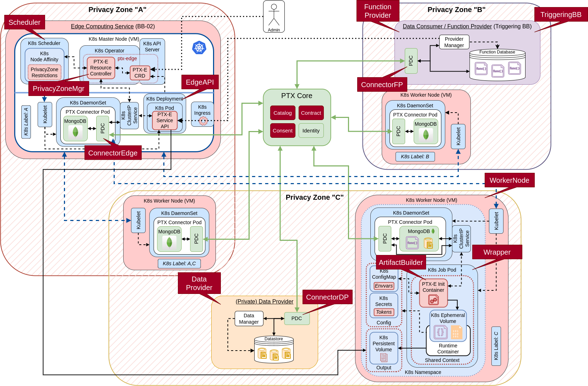

# Edge computing - AI processing BB

The *Edge Computing (Decentralized AI processing) BB* (BB-02) provides value-added services
exploiting an underlying distributed edge computing infrastructure (e.g., owned and operated
by Cloud Providers).

Two main high-level objectives are targeted by these services:

- **Privacy-preserving**, where data is kept close to the user, more exactly within a pre-defined
privacy zone.
- **Efficient near-data processing**, with optimized performance and resource utilization.

In general, the main goal is to move (AI) processing functions close to the data source
and execute them on-site. If the execution capability is available on-site, that is, in the
virtual/physical node storing the data, the data-consuming software function (as a FaaS
based operation) or container (as a CaaS based operation) is launched there (e.g., by a 
Kubernetes-based orchestration framework). Thus, we can avoid the transmission of a large
amount of data and address privacy challenges designated by geographical or provider-related
rules and demands.

As a more realistic scenario, the data can also be moved for processing but only within a
pre-defined **privacy zone**. This privacy zone primarily encompasses a set of worker nodes
(using the Kubernetes terminology), that are suitable in the sense of pre-defined privacy
rules and where processing functions can and should be deployed on demand.

## Design Document

See the comprehensive design document [here](docs/design-document.md).

Since the functionalities of the Edge Computing BB fundamentally rely on the **Kubernetes** (K8s)
container orchestration platform (realistically spanning multiple providers' domains/clouds), 
its value-added services are implemented as standalone software containers, operated in a 
dedicated Kubernetes namespace, and several PTX-tailored extensions of the Kubernetes framework itself.

The main components of the BB-02's functionality cover the followings:

- Provide a generic runtime environment for data-processing functions.
- Provide the ability to deploy pre-built containers with privacy-preserving options.
- Provide the capability of managing and orchestrating by privacy-zone labels.
- Use the PTX Connector to interact with PTX core elements.
- Implement and control the process of obtaining data for data consumer functions/software.
- Implement a separate REST-API interface for the integration with PTX dataspace.

See the detailed Kubernetes-based architecture and their component binding to the main
design document in
[kubernetes/design](kubernetes/design) folder.



*Binding of BB-02 components to K8s features.*


## Building instructions

### Production

Since BB-02 is basically a set of extensions to the Kubernetes framework, instead of 
standalone containerized software modules, its installation and setup require different
steps, and most of all, an operating **vanilla Kubernetes cluster** as a prerequisite.

There are many methods and tools for setting up a production-grade Kubernetes cluster on
a local machine, see for example the Kubernetes'
[official documentation](https://kubernetes.io/docs/setup/), or pick any of the numerous
[certified platforms](https://kubernetes.io/docs/setup/production-environment/turnkey-solutions/)
or managed cloud services available online.

The installation and configuration steps are grouped together into separate helper scripts
with a dedicated [Makefile](Makefile), which is intended to use Kubernetes packages 
called [Helm charts](https://helm.sh/) internally.

To install the dependencies and the **ptx-edge extension** assuming a default `kubectl` 
profile for a running Kubernetes cluster, use the following instruction:
```bash
$ make setup
```

> [!IMPORTANT]
> 
> Since BB-02 is still under development, Makefile targets point 
> directly to the targets in the test Makefile in `kubernetes/test`!


or execute the helper scripts directly:
```bash
$ # TBD
```

or install necessary resources/dependencies and the ptx-edge Helm charts
manually:
```bash
$ # TBD
```

### Development & Testing

> [!NOTE]
> 
> The BB-02 module is unique in that sense that it cannot be seamlessly run by a 
> container framework, such as Docker or Podman, as it is inherently based on container 
> orchestration features of a higher architecture level.

However, for development and testing purposes, full-fledged but lightweight clusters of
different Kubernetes distributions can be set up on the fly even in a single virtual machine.

For example, the [kind](https://kind.sigs.k8s.io/), [k3d](https://k3d.io/stable/), and
[minikube](https://minikube.sigs.k8s.io/docs/) tools
are purposefully designed for creating and spinning up local, *multi-node* K8s
clusters/sandboxes using `docker` with little hassle and resource usage.
These are meant for developers to test Kubernetes distributions on their (isolated)
development machine, but are also suitable for local development, CI, and testing.

The K8s control plane and worker nodes are created as **separate docker containers** based
on special-built docker images, which 

- are capable of running arbitrary software modules as preloaded docker images using
  **docker-in-docker**,
- run standard K8s distribution components, e.g., `kubelet`,
- that can be configured via the standard `kubectl` tool from the host machine.

See detailed description of these tools, their installation, and configuration for `ptx-edge` 
in [kubernetes/test](kubernetes/test/README.md).

Nevertheless, the `ptx-edge` extension's *customer-facing API* can be separately run
in a single container as a mockup for integration test cases.
See further about Docker-based testing 
- in the *Level 1* testing setup [here](kubernetes/test/levels/level1/Makefile)
with the related [README.md](kubernetes/test/README.md#level-1-testing-single-docker-image)
- or in the mockup REST-API's [README.md](kubernetes/test/mock-api/README.md)
in `kubernetes/test/mock-api`.


## Running instructions

To start `ptx-edge` components, run
```bash
make run
```
while for tearing down the components, execute
```bash
make cleanup
```

> [!IMPORTANT]
> 
> Since BB-02 is still under development, Makefile targets point 
> directly to the targets in the test Makefile in `kubernetes/test`!

The installed Helm chart launches the included `ptx-edge` services automatically,
but it does not wait until all the resources are running before it exits!

To check the current status of the installed chart's components, use the following
command:
```bash
$ # TBD
```

To keep track of a release's state, or to re-read configuration information, you can
use
```bash
$ # TBD
```

## Example usage

The `ptx-edge` K8s extension provides a separate REST-API in
[kubernetes/src/rest-api](kubernetes/src/rest-api) 
to integrate its features with the PTX core components.

The API uses the [FastAPI](https://fastapi.tiangolo.com/) Python package to implement
its endpoints and also define the related OpenAPI3.1 specification directly from the
Python software code.

#### REST-API

- The REST-API uses the following base URL: ``http://<service_name>:8080/ptx-edge/v1/``.
- The interactive API interface (Swagger UI) lives here: ``http://<service_name>:8080/ptx-edge/v1/ui/``
- The OpenAPI specification is available at ``http://<service_name>:8080/ptx-edge/v1/openapi.json``

Additionally, the latest OpenAPI specification is auto-generated and updated at every commit
and can be found [here](kubernetes/src/rest-api/spec/openapi.yaml).

#### Testing

For testing purposes, a mock-API is generated based on the BB-02's predefined
[OpenAPI specification](kubernetes/test/mock-api/swagger_server/swagger/swagger.yaml).

The detailed description of the mock-API and its internal test cases can be found
in the related [Readme](kubernetes/test/mock-api/README.md).

The REST-API endpoints can be easily tested in the following two approaches:

- Calling directly on the specific endpoint using e.g., ``curl`` and Python's ``json`` module.
For example,
```bash
$ curl -sX 'GET' \
       -H 'accept: application/json' \
       'http://localhost:8080/ptx-edge/v1/version' | python3 -m json.tool
{
    "api": "0.1",
    "framework": "1.1.4"
}

```

- Manually testing endpoints with in-line test data on its
[Swagger UI](kubernetes/test/README.md#rest-api-mockup). 

#### Examples:

The following table contains example API calls with successful results.

Further test cases for incorrect input data and other failures are collected in the
mock-APIs unit tests in
[kubernetes/test/mock-api/swagger_server/test/](kubernetes/test/mock-api/swagger_server/test).

To validate the endpoints, send the following requests to the main REST-API using the URL:
``http://<service_name>:8080/ptx-edge/v1/<endpoint>``.

| Endpoint                | HTTP verb | Example input (JSON)                                                                                                                                                                                                                                                                                              | Response Code | Example output (JSON)                                                                                                                                                                            |
|-------------------------|:---------:|-------------------------------------------------------------------------------------------------------------------------------------------------------------------------------------------------------------------------------------------------------------------------------------------------------------------|:-------------:|--------------------------------------------------------------------------------------------------------------------------------------------------------------------------------------------------|
| /version                |    GET    | -                                                                                                                                                                                                                                                                                                                 |      200      | <pre>{"api": "0.1",<br/> "framework": "1.1.4"}</pre>                                                                                                                                             |
| /requestEdgeProc        |   POST    | <pre>{"data": "Data42",<br/> "data_contract": "Contract42",<br/> "func_contract": "Contract42",<br/> "function": "FunctionData42",<br/> "metadata":<br/>     {"CPU-demand": 42,<br/>      "privacy-zone": "zone-A",<br/>      "timeout": 42}</pre>                                                                |      202      | <pre>{"data": "Data42",<br/> "function": "FunctionData42",<br/> "metrics":<br/>     {"elapsed_time": 2,<br/>      "ret": 0},<br/> "uuid": "e09270d1-2760-4fba-b15a-255a9983ddd6"}</pre>          |
| /requestPrivacyEdgeProc |   POST    | <pre>{"consent": "Consent42",<br/> "data_contract": "Contract42",<br/> "func_contract": "Contract42",<br/> "function": "FunctionData42",<br/> "metadata":<br/>     {"CPU-demand": 42,<br/>      "privacy-zone": "zone-A",<br/>      "timeout": 42},<br/> "private_data": "Data42",<br/> "token": "Token42"}</pre> |      202      | <pre>{"function": "FunctionData42",<br/> "metrics":<br/>     {"elapsed_time": 10,<br/>      "ret": 0},<br/> "private_data": "Data42",<br/> "uuid": "a62e865c-a13d-475e-acc1-bce4ff3be66c"}</pre> |
