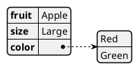
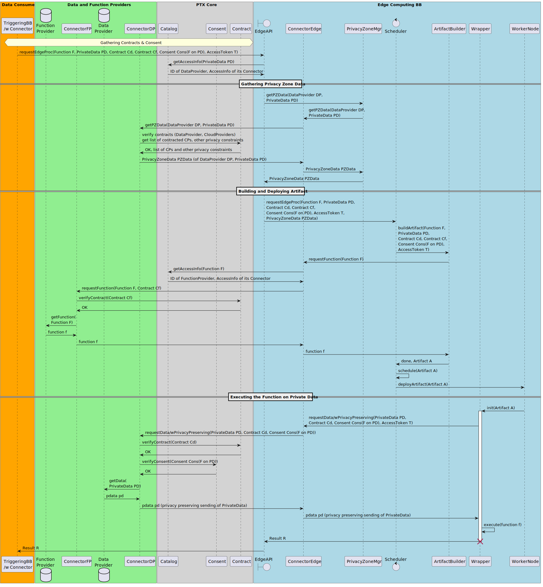

# Edge computing - AI processing BB – Design Document
<!---
_This is just a template.
Replace italic text with your own content.
Replace the title with `<BB name> Design Document`.
Using [Mermaid](http://mermaid.js.org/intro/) and/or
[PlantUML](https://plantuml.com/) diagrams are recommended; see
examples below.
You should also remove this paragraph._
--->

The Edge Computing (Decentralized AI processing) BB provides
value-added services exploiting an underlying distributed edge
computing infrastructure (e.g., owned and operated by Cloud Providers).

Two main high-level objectives are targeted by these services:
  - Goal 1: privacy-preserving - keep the data close to the user, more
    exactly within a pre-defined privacy zone
  - Goal 2: efficient near-data processing - optimize performance and
    resource utilization

## Technical Usage Scenarios & Features
<!---
_Brief summary of use cases and features.
See "BB info for use cases (WP2)" spreadsheet._
--->

In general, the main Goal is to move the processing functions close to
the data and execute them on-site. If the execution capability is
available in the node storing the data, the processing function (FaaS
based operation) or container (CaaS based operation) is launched there
(e.g., by the Kubernetes/Knative platform). By these means, we can
avoid the transmission of a large amount of data. (Goal 2)

As a more realistic use case, the data is also moved but only within a
pre-defined privacy zone. This privacy zone encompasses worker nodes
(using Kubernetes terminology) where we can deploy the processing
functions on demand. (Goal 1)

### Features/Main Functionalities
<!--
_In-depth description of BB features (details).
Again, an enumeration (ie bullet points) is useful. Take input from
description for WP2_
-->

  - Control the placement of data: keep within pre-defined privacy
    zones
  - Only trustworthy infrastructure is used for data processing
    - trustworthy: contract needed between Data Provider and Cloud Provider
  - Efficient (green) operation: minimizing data transfers if
    near-data / on-site processing is available
  - Moving the processing functions / containers dynamically

### Technical Usage Scenarios
<!--
_In-depth description of the use cases of the BB.
Explain why would one want to use this BB.
What services, features does it offer, why these are useful.
A bullet point list is recommended._
-->

#### Scenario 0: Set up Infrastructure
  - Launch VMs spanning across multiple Cloud Providers infrastructure
    via IaaS
  - Deploy Kubernetes cluster to the VMs
  - Set metadata of Worker nodes / edge sites including Cloud Provider
    info
    - to be able to check privacy-zone memberships
  - Perform optional configurations (e.g., CNI, Istio for tenant
    isolation)
  - Tailor-made Kubernetes/Knative scheduler controls placement
    decisions (data, function/container)

#### Scenario 1: Privacy-preserving AI Processing
  - General BB triggers a processing function to be executed on
    PrivateData
    - goal: keep the data within the privacy zone determined by the
      contract between the Data- and Cloud Providers
    - using only reliable infrastructure
  - Privacy zone of PrivateData is determined
    - making use of Connector and Contract services
  - Privacy zones of worker nodes / edge sites have already been
    determined
  - Software artifact is created
    - processing function is gathered via the Connector
    - consent related data (e.g., AccessToken) is also added
  - Tailor-made Kubernetes/Knative scheduler selects the worker
    node(s) / edge site(s) within the privacy zone
    - making use of novel scheduler algorithms
    - other optimization constraints, objectives can also be taken
      into account
  - Software artifact is deployed to the selected worker node(s) /
    reliable Edge Site(s)
    - option 1: container (CaaS)
    - option 2: function (FaaS)
  - PrivateData is gathered by the artifact
    - privacy-preserving data sharing is requested from the Connector
  - Processing function is executed on PrivateData at a reliable Edge
    Site
  - Result is provided
  - PrivateData is deleted at the Edge Site
  - Software artifact (function / container) is destroyed at the Edge
    Site

More details of the communications related to Scenario 1 are given
here: [Dynamic Behaviour](#dynamic-behaviour)

#### Scenario 2: Efficient Near-data Processing
  - General BB triggers a processing function to be executed on
    PrivateData
    - precondition: worker node(s) is/are "collocated" with
      PrivateData (it is directly available from the worker node)
  - Software artifact is created
    - processing function is gathered via the Connector
  - Tailor-made Kubernetes/Knative scheduler selects the worker
    node(s) / edge site(s) collocated with PrivateData
    - making use of novel scheduler algorithms
    - other optimization constraints, objectives can also be taken
      into account
  - Software artifact is deployed to the selected worker node(s) /
    local Edge Site(s)
    - option 1: container (CaaS)
    - option 2: function (FaaS)
  - Processing function is executed on PrivateData at a local Edge
    Site
  - Result is provided
  - Software artifact (function / container) is destroyed at the Edge
    Site

## Requirements
<!---
_High-level BB requirements with identifiers.
eg * **R1.** BB MUST communicate with [other BB]_

_See also the Requirements spreadsheets

Functional requirements should be extended with extra-functional ones:
Timeliness (expected response time@request size), Throughput (number of
requests served by the BB),etc.
These may be defined later with UCs but have to be identified here
and be part of configuration/deployment options_
--->

### Infrastructure-related Requirements

  - **R1.** [OPS, SEC] BB-2 MUST have access to infrastructure (of
    e.g., a Cloud Provider or private one)
  - **R2.** [OPS] BB-2 MUST be able to deploy (and start/stop/destroy)
    a Kubernetes cluster to Cloud Provider's infrastructure via IaaS
    offerings
  - **R3.** [OPS] BB-2 MUST be able to manage its Kubernetes
    cluster(s)
  - **R4.** [OPS] BB-2 MIGHT have access to managed Kubernetes cluster
    of Cloud Provider
  - **R5.** [OPS, SEC] BB-2 SHOULD be able to configure CNI plugins of
    Kubernetes and Istio service mesh

### Requirements Related to Data Sharing and Processing

  - **R6.** [FUNC] BB-2 MUST be able to move data from Data Provider
    to given node of its Kubernetes cluster making use of Connector
    and Catalog
  - **R7.** [FUNC] BB-2 MUST be able to gather function from Function
    Provider making use of Connector and Catalog
  - **R8.** [FUNC] BB-2 MUST be able to build software artifact from
    the function and contract/consent related parameters
  - **R9.** [FUNC] BB-2 MUST support Container-as-a-Service OR
    Function-as-a-Service based operation
  - **R10.** [FUNC] BB-2 MUST support privacy-aware scheduling in its
    Kubernetes cluster
  - **R11.** [FUNC] BB-2 MUST support data-availability-aware
    scheduling in its Kubernetes cluster
  - **R12.** [FUNC] BB-2 MUST support privacy-preserving data sharing
    among nodes
  - **R13.** [FUNC] BB-2 SHOULD provide FaaS (or CaaS) APIs to data
    processing BBs
  - **R14.** [FUNC] Annotation of DATA with privacy zone and
    geographical info MUST be supported


## Integrations
<!--
_See "01_BB Connections" spreadsheet_
-->

### Direct Integrations with Other BBs
<!--
_What other BBs does this BB interact with directly (without the
connector)?  How?  Why?_ 
-->

  - Cloud Providers
  - Connector
    - introduce the concept of Privacy Zone
    - support Function sharing
    - support privacy-preserving Data sharing
  - Contract
    - support DataProvider - CloudProvider contracts including Privacy
      Zone information
  - Consent
    - (if it is not available) introduce consent (and its
      verification) enabling the execution of processing function on
      private data
  - BB-1 Decentralized AI training
    - tight integration with the specific protocol
  - BB-8 Data Veracity Assurance
    - check the configuration data to be exchanged
<!--  - BB-9a PLRS ? -->

### Integrations via Connector
<!--
_What other BBs does this BB integrate with intermediated by the
connector?  Why?_
-->

The integration with all other BBs playing the role of the
TriggeringBB is expected to be done via the Connector.

### Integration with Data Processing Chain Protocol

Primarily, BB-02 can play an Infrastructure Service role in the DPC protocol.
In general, it provides data processing capability by executing a processing
function (obtained form a Function Provider on-the-fly) on a dataset (obtained
from a Data Provider or a prior data processing service).

The integration with the Service Chain Protocol should be straightforward as
BB-02 uses the Connector to communicate with the dataspace components.

The caller BB in the role of the TriggeringBB and the prior data processing
service initiates the call of a function as the next data processing service
(or data consumer).
The result of the called processing functionality is propagated to the Chain
Protocol, which can be 
- the transformed data,
- or just the processing result/status and the localization URI of the result
(depending on the called function's implementation).

### Integration with Infrastructure Providers

The Edge computing BB requires a set of computation platforms/VMs (even over
multiple clouds) to operate the underlying orchestration framework
(Kubernetes/Knative) and execute processing functions on them.

In a managed approach, BB-02 uses a higher-level managed Kubernetes cloud service.
The integration in this case only requires configuration capabilities from
the cloud provider to be able to
 - apply necessary Kubernetes extensions/manifests,
 - define service access points (REST-API).

In this case, BB-02 functionality is implemented as a Kubernetes 
extension/application operated by the cloud provider.

In a direct approach, BB-02 builds on lower-level IaaS cloud services.
This approach assumes that the considered orchestration framework need to
be set up, configured and managed by the BB owner/provider.
This also allows for multi-cloud and edge cloud setups as well.
The integration in this case requires configuration and availability
capabilities from the cloud provider to be able to
 - access to the compute infrastructure (VMs),
 - deploy and provision orchestration framework (Kubernetes),
 - apply necessary Kubernetes extensions/manifests,
 - define service access points (REST-API),
 - configure optional session encryption, request ingress and load balancing
features.

In this case, BB-02 functionality is deployed on a tailored Kubernetes instance
that is managed and operated by the BB owner.

## Relevant Standards

### Data Format Standards
<!--
_Any data type / data format standards the BB adheres to_
-->

The main data format standards to be followed in internal and external
data exchange will be:

- [JSON](https://www.json.org/) or [JSON-LD](https://json-ld.org/) for
  serialization in general
- [YAML](https://yaml.org/) for Kubernetes and Knative related data
  structures


### Mapping to Data Space Reference Architecture Models

This building block integrates an instance of the _Prometheus-X
Dataspace Connector (PDC)_ to act as a data provider to:

- Receive requests by other building blocks ("TriggeringBB" via their
  PDC) acting as data consumers or service consumers
- Respond to requests by other building blocks ("TriggeringBB" via
  their PDC) acting as data consumers or service consumers

[Connector](https://docs.internationaldataspaces.org/ids-knowledgebase/v/ids-ram-4/layers-of-the-reference-architecture-model/3-layers-of-the-reference-architecture-model/3_5_0_system_layer/3_5_2_ids_connector),
[Data
Provider](https://docs.internationaldataspaces.org/ids-knowledgebase/v/ids-ram-4/layers-of-the-reference-architecture-model/3-layers-of-the-reference-architecture-model/3-1-business-layer/3_1_1_roles_in_the_ids#business-roles-in-the-international-data-space),
[Data
Consumer](https://docs.internationaldataspaces.org/ids-knowledgebase/v/ids-ram-4/layers-of-the-reference-architecture-model/3-layers-of-the-reference-architecture-model/3-1-business-layer/3_1_1_roles_in_the_ids#business-roles-in-the-international-data-space)
and [Service
Consumer](https://docs.internationaldataspaces.org/ids-knowledgebase/v/ids-ram-4/layers-of-the-reference-architecture-model/3-layers-of-the-reference-architecture-model/3-1-business-layer/3_1_1_roles_in_the_ids#business-roles-in-the-international-data-space)
are defined in [IDS-RAM
4.0](https://docs.internationaldataspaces.org/ids-knowledgebase/v/ids-ram-4/layers-of-the-reference-architecture-model/3-layers-of-the-reference-architecture-model/3-1-business-layer/3_1_1_roles_in_the_ids#business-roles-in-the-international-data-space).

This building block interacts with the _Catalog_, _Contract_ and
_Consent_ components provided by the _(Personal) Data Space
Intermediary_.  [Data Space
Intermediary](https://dssc.eu/space/BVE/367558657/Data+Space+Intermediary)
and [Personal Data
Intermediary](https://dssc.eu/space/BVE/367558657/Data+Space+Intermediary#Personal-data-intermediaries)
are defined in [DSSC
blueprint](https://dssc.eu/space/BVE/357073006/Data+Spaces+Blueprint+v1.0). The
services offered by the Data (Space) Intermediary are described as
[Core
Services](https://dssc.eu/space/BVE/367558657/Data+Space+Intermediary)
or [Enabling
Services](https://dssc.eu/space/BVE/367558657/Data+Space+Intermediary)
by DSSC blueprint and defined as [Data Intermediation
Services](https://eur-lex.europa.eu/legal-content/EN/TXT/HTML/?uri=CELEX:32022R0868#d1e965-1-1)
by the [Data Governance
Act](https://eur-lex.europa.eu/legal-content/EN/TXT/?uri=CELEX%3A32022R0868).

## Input / Output Data
<!--
_What data does this BB receive?
What data does this BB produce?
If possible, elaborate on the details (data format, contents, etc) and
also add potential data requirements._
-->

The following data types and variables are used in the subsequent
diagrams and descriptions.

| Data Type       | Variable      | Description                                                                                                                |
|-----------------|---------------|----------------------------------------------------------------------------------------------------------------------------|
| AccessInfo      | access        | ID of a Provider and access info (REST API) of its Connector                                                               |
| PrivateData     | PD            | reference/ID of the private data                                                                                           |
| pdata           | pd            | the exact private data                                                                                                     |
| Data            | D             | reference/ID of the NOT private data                                                                                       |
| data            | d             | the exact NOT private data                                                                                                 |
| Function        | F             | reference/ID of the function to be applied to the private data (function-specific configuration data can also be included) |
| function        | f             | the exact function                                                                                                         |
| Contract        | Cd and Cf     | contracts between the TriggeringBB and DataProvider and FunctionProvider, respectively                                     |
| Consent         | Cons(F on PD) | the consent from the User which allows the execution of the function on private data                                       |
| AccessToken     | T             | token created by the DataProvider related to the user's consent                                                            |
| PrivacyZoneData | PZData        | describing the privacy zone information related to the DataProvider and PrivateData                                        |
| Artifact        | A             | software artifact: container (CaaS) or function (CaaS) depending on the infrastructure                                     |
| Result          | R             | the result of the function execution on private data                                                                       |

Customer-facing API (EdgeAPI):

	- requestEdgeProc(
		Function F, PrivateData PD, 
		Contract Cd, Contract Cf, 
		Consent Cons(F on PD), AccessToken T)
	  output: Result R
	- requestEdgeProc(
		Function F, Data D, 
		Contract Cd, Contract Cf)
	  output: Result R

Connector-facing API (PrivacyPreservingPDC):

	- getPZData(
		DataProvider DP, PrivateData PD)
	  output: PrivacyZoneData PZData
	- requestFunction(
		Function F, Contract Cf)
	  output: function f
	- requestData/wPrivacyPreserving(
		PrivateData PD, 
		Contract Cd, 
		Consent Cons(F on PD))
	  output: pdata pd

Catalog extension:

	- getAccessInfo(
		Function F)
	  output: ID of FunctionProvider and AccessInfo (e.g., REST API) of its Connector

<!--
_Mermaid has no such feature, but you may use PlantUML to
automatically visualize JSON schemata; for example:_



_Creating the diagram via the PlantUML JAR:_

```shell-session
$ java -jar plantuml.jar -tsvg json.puml
```

_Gives:_


-->

<!--
_Please add a short description, also estimating the workload for a
typical transaction of your BB (e.g., "100.000 record/submission",
"traces of n*10.000s of events", etc.)._
-->

The performance and the typical workload for a transaction cannot be
estimated in general because these parameters strongly depend on the
specific processing function and the (private) data which the function
is executed on.


## Architecture
<!--
_What components make up this BB?
If applicable, insert a simple figure, eg a UML class diagram.
What is the purpose of the components and what are their relationships?_
-->

The high-level architecture of the Edge Computing BB is shown by the
following figure.


The architecture of the Edge Computing BB is described by the
following class diagram.


The purpose and tasks of the BB components are given in the table
below.

| BB Component         | Description                                                                                                             |
|----------------------|-------------------------------------------------------------------------------------------------------------------------|
| EdgeAPI              | Entry point of the BB                                                                                                   |
| PrivacyZoneMgr       | Gather, handle, process privacy zone data related to the DataProvider and the PrivateData                               |
| PDC                  | Prometheus-X DataSpace Connector (core component)                                                                       |
| PrivacyPreservingPDC | Extended PDC equipped with the capability of privacy preserving data sharing and with function sharing (part of the BB) |
| Scheduler            | Custom Kubernetes Scheduler taking also privacy related information into account                                        |
| ArtifactBuilder      | Build the software artifacts to be deployed (abstract class)                                                            |
| CaaS/FaaSBuilder     | CaaS and FaaS based implementation of the ArtifactBuilder                                                               |
| Wrapper              | Wrapper functions/services/data (e.g., AccessToken) added to the software artifact (abstract class)                      |
| CaaS/FaaSWrapper     | CaaS and FaaS based implementation of the Wrapper                                                                       |
| WorkerNode           | Kubernetes/Knative worker node (edge node) which can execute the container/function                                     |

## Dynamic Behaviour
<!--
_What is the behaviour of the BB, how does it operate?
UML sequence diagrams and/or statecharts are recommended._

_Example sequence diagram using Mermaid:_
-->

The following sequence diagram shows how the components communicate with each other, assuming the most complex and relevant operation: Scenario 1.



Assumptions:
- Three different contracts are considered:
  - DataProvider - CloudProvider
  - DataProvider - Triggering BB (Consumer)
  - FunctionProvider - Triggering BB (Consumer)
  - the latter can be omitted when the Triggering BB is the
    FunctionProvider
- Consent: DataProvider, Private Data of User, Function which can be
  applied to the Private Data
- Consent related tasks are handled by the Triggering BB in advance
  (Edge Computing BB with its connector is added to the loop)

| BB Component    | Description                                                                                                                                                                                                                    |
|-----------------|--------------------------------------------------------------------------------------------------------------------------------------------------------------------------------------------------------------------------------|
| EdgeAPI         | Entry point of the BB                                                                                                                                                                                                          |
| PrivacyZoneMgr  | Gather, handle, process privacy zone data related to the DataProvider and the Data                                                                                                                                             |
| ConnectorEdge   | The connector functionality of the data consumer is delegated to the Edge Computing BB, it is the counterpart of the provider's connector equipped with the capability of privacy preserving data sharing and function sharing |
| Scheduler       | Custom Kubernetes Scheduler                                                                                                                                                                                                    |
| ArtifactBuilder | Build the software artifacts to be deployed                                                                                                                                                                                    |
| Wrapper         | Wrapper functions/services/data added to the container/function artifact                                                                                                                                                       |
| WorkerNode      | Kubernetes worker node (edge node) which can execute the container/function                                                                                                                                                    |

| Other Actors             | Description                                                                                                                                                                                                |
|--------------------------|------------------------------------------------------------------------------------------------------------------------------------------------------------------------------------------------------------|
| Triggering BB (Consumer) | The triggering BB which plays the role of the data and function consumer. It also provides the consent related information gathered in advance making use of its own connector (not shown in the diagram). |
| FunctionProvider         | Storing the processing function to be executed (it can be the Triggering BB itself)                                                                                                                        |
| ConnectorFP              | The connector of the function provider equipped with the capability of function sharing                                                                                                                    |
| DataProvider             | Storing the data including personal data                                                                                                                                                                   |
| ConnectorDP              | The connector of the data provider equipped with the capability of privacy preserving data sharing                                                                                                         |
| Contract                 | Prometheus-X core component (might be extended)                                                                                                                                                            |
| Catalog                  | Prometheus-X core component extended with function sharing capability                                                                                                                                      |
| Consent                  | Prometheus-X core component (might be extended)                                                                                                                                                            |

The main steps of the operation are detailed below.

### Detailed steps of the operation realizing Scenario 1 (privacy-preserving AI processing)
  - Triggering BB gathers Contracts (Cd: Triggering BB - DataProvider,
    Cf: Triggering BB - FunctionProvider), Consent Cons(F on PD),
    AccessToken T making use of its own connector (not shown in the
    diagram)
  - Triggering BB triggers the execution of Function F on PrivateData
    PD via EdgeAPI
    - Input: reference/ID of Function F, reference/ID of PrivateData
      PD, Contracts Cd, Cf, Consent Cons(F on PD), AccessToken T
  - EdgeAPI gets access info to PD (ID of DataProvider, RestAPI of its
    Connector)
  - ---
  - PrivacyZoneMgr gathers/calculates Privacy Zone information PZData
    related to DataProvider DP and PrivateData PD
    - making use of Connectors (ConnectorEdge, ConnectorDP)
    - and Contract services
  - Privacy zones of worker nodes / edge sites have already been
    determined
  - --- 
  - Scheduler is requested to execute F on PD
    - Input: reference/ID of Function F, reference/ID of PrivateData
      PD, Contracts Cd, Cf, Consent Cons(F on PD), AccessToken T,
      PrivacyZoneData PZData
  - ArtifactBuilder is invoked to build the software artifact
    - Input: reference/ID of Function F, reference/ID of PrivateData
      PD, Contracts Cd, Cf, Consent Cons(F on PD), AccessToken T
  - Function F is requested via Connectors
    - ConnectorEdge uses Catalog to get the FunctionProvider's
      Connector (ConnectorFP)
    - ConnectorFP is requested for Function F
    - Contract is checked
    - function f is provided
  - Software artifact is built (including a Wrapper)
  - Tailor-made Kubernetes/Knative scheduler selects the worker
    node(s) / edge site(s) within the privacy zone
  - Software artifact is deployed to the selected worker node(s) /
    reliable Edge Site(s)
    - option 1: container (CaaS)
    - option 2: function (FaaS)
  - ---
  - PrivateData PD is gathered by the artifact
    - privacy-preserving data sharing is requested from the
      ConnectorEdge
    - Input: reference/ID of PrivateData PD, Contract Cd, Consent
      Cons(F on PD), AccessToken T
    - ConnectorPD verifies Contract Cd and Consent Cons(F on PD)
    - pdata pd is provided
  - Processing function f is executed on pdata pd at a reliable Edge
    Site (WorkerNode)
  - Result R is provided
  - pdata pd is deleted at the Edge Site (WorkerNode)
  - Software artifact (function / container) is destroyed at the Edge
    Site (WorkerNode)

## Configuration and Deployment Settings

<!-- 
_What configuration options does this BB have?  What is the
configuration format?  Provide examples.  How is the component logging
the operations? What are the error Scenarios? What are the limits in
terms of usage (e.g., number of requests, size of dataset, etc.)?_
-->

### Configuration Parameters

The operational parameters of the BB will be described in a
corresponding YAML configuration file.  It will be composed of the
following relevant elements:

- Scheduler algorithm to be used (we plan multiple options)
- Initial content of the Privacy Zone database (to be defined later)
- Description of the Kubernetes (or later Knative) infrastructure.  As
  a first step, we plan a static configuration to be used describing
  the worker nodes in different Cloud Provider domains and the related
  parameters/metadata.  Later, the dynamic management of the overlay
  infrastructure will also be supported, i.e., worker nodes can be
  added/removed on-the-fly.

Configuration of the Prometheus-X Data Space Connector (PDC) is
documented by the PDC building block.

### Logging

The BB will use a [Prometheus](https://prometheus.io/) based
monitoring service which is an open-source tool and a standard
approach in Kubernetes systems.  Besides the relevant
infrastructure-level operational data, the Edge Computing BB related
logging information will also be integrated into the monitoring
system.  Furthermore, customized alerting configuration will also be
supported

In addition, a [Grafana](https://grafana.com/) dashboard will be added
where the operator of the BB can visually follow and inspect the
relevant operational parameters.

### Error Scenarios

The following error Scenarios are identified at the current design
stage:

- Authorization related issues
  - Unauthorized request received due to invalid token
  - Request prohibited by insufficient contract/consent
  - Undeployable request due to privacy zone restriction

- Dataspace related configuration issues
  - Function not found in Catalog or at the Function Provider
  - Private Data or Data not found in Catalog or at the Data Provider
  - Privacy zone not found or cannot be calculated

- Infrastructure related issues
  - Insufficient compute resources or unavailable deployment service
  - Function deployment timeout
  - Execution request parameters not found or invalid

Each error Scenario results in refusing the request and providing the
identified root cause.


## Third Party Components & Licenses
<!--
_Does this BB rely on any 3rd-party components?
See also the "EDGE third party/background components" spreadsheet.
-->

Our implementation will be built on Kubernetes and Knative which
components are licensed under the Apache License 2.0.  Our BB will use
the same license.

<!--

## Implementation Details
_This is optional: remove this heading if not needed.
You can add details about implementation plans and lower-level design
here._

TBD
-->

## OpenAPI Specification
<!--
_In the future: link your OpenAPI spec here._
-->

The curren version of the OpenAPI specification can be found here:

[Edge Computing BB - OpenAPI specification](../spec/openapi.yaml)


## Test Specification
<!--
_Test definitions and testing environment should be available, and
the tests should be repeatable._
-->

### Test Plan
<!--
Testing strategy, tools and methods chosen, methods for acceptance
criteria.
To be detailed.
-->

At a first step, the REST APIs of the BB will be tested making use of
e.g., Postman to generate test requests. A mockup version of the BB
will be responsible for checking the input parameters and their
formats and for providing dummy answers.

In addition, the Connector (PDC) related extensions, such as Privacy
Zone information handling, will also be mimicked at this stage.

As a second step, component related tests will be designed.  The
following entities can be tested separately at this level:

- ArtifactBuilder: the BB-internal Connector (ConnectorEdge) provides
  a static function which should be used when building the artifact
  (container at first, function later).  The result can be verified as
  follows.

- Testing the artifact: the manually or automatically deployed
  artifact should gather the private data and execute the given
  function.  The result can easily be verified for the test Scenario.
  Data Provider (mockup) for testing purpose is also needed.

- Scheduler: we assume that the Privacy Zone information and the
  software artifact are available in advance, then the placement
  decision and the exact deployment process should be tested and
  verified.

As a third step, integration tests will be defined which can be used
to validate the interoperation among the internal components of the
BB.  First, the ArtifactBuilder - Scheduler cooperation can be tested
which integrates the previously defined component tests.  Second, the
Privacy Zone calculation process can be tested including the
PrivacyZoneMgr, ConnectorEdge and EdgeAPI.  And third, the overall
workflow can be tested involving each component.

Finally, the integration tests with external BBs and the core
components will be defined.  The relevant entities are the following
(according to our current view):

- Connector (Privacy Zone, Function sharing, privacy-preserving Data
  sharing)
- Contract (DataProvider - CloudProvider contracts including Privacy
  Zone information)
- Consent (consent and its verification enabling the execution of
  processing function on private data)
- BB-1 Decentralized AI training (tight integration with the specific
  protocol)
- BB-8 Data Veracity Assurance (configuration data to be exchanged)
- Cloud Providers (basic IaaS operation)


<!--

### Internal unit tests
_Here specify the test cases for the units inside the BB.  
Candidates for tools that can be used to implement the test cases:
JUnit, Mockito, Pytest._


TBD

### Component-level testing

_Here specify how to test this component/BB as a whole. This is similar to how other BBs will use this component.  
Candidates for tools that can be used to implement the test cases: K6, Postman, stepci, Pact  
An example tutorial is available
[here](https://github.com/ftsrg-edu/swsv-labs/wiki/2b-Integration-testing)._


TBD

### UI test (where relevant)
_Candidates for tools that can be used to implement the test cases:
Selenium_

TBD
-->


## Partners & Roles

- BME will lead the task, work on the design and implementation of the
  BB, integrate privacy-aware scheduler algorithms
- Fraunhofer ISST / University of Koblenz will provide support in the
  integration of technology (such as the *Prometheus-X Connector* and
  *Prometheus-X Contract/Consent Manager*) to support federation of
  edge clouds with data spaces in this context.
- University of Oslo will design and implement novel scheduler
  algorithms, formalize the related problems and evaluate the methods

## Usage in the Dataspace

This building block is part of the service chain with the title "Decentralized AI Training". That service chain defines how these two building blocks can be integrated into one combined solution.

Furthermore, it's planned to integrate and showcase this building block in the Use Case "Job Opening Prediction". Details of this use case are still under development, the design will be further discussed.
