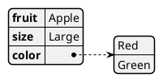
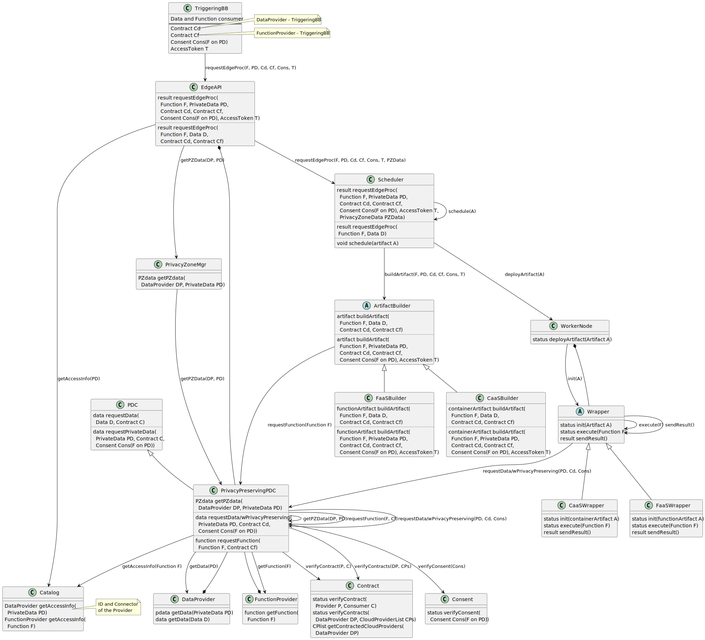

# Edge computing - AI processing BB – Design Document

<!---
_This is just a template.
Replace italic text with your own content.
Replace the title with `<BB name> Design Document`.
Using [Mermaid](http://mermaid.js.org/intro/) and/or [PlantUML](https://plantuml.com/) diagrams are recommended; see examples below.
You should also remove this paragraph._
--->

The Edge Computing (Decentralized AI processing) BB provides value-added services exploiting an underlying distributed edge computing infrastructure (e.g. owned and operated by Cloud Providers).

Two main high-level objectives are targeted by these services: 
  - goal 1: privacy-preserving: keep the data close to the user, more exactly within a pre-defined privacy zone
  - goal 2: efficient near-data processing: optimize performance and resource utilization


## Technical usage scenarios & Features


<!---
_Brief summary of use cases and features.
See "BB info for use cases (WP2)" spreadsheet._
--->

In general, the main goal is to move the processing functions close to the data, and execute them on-site. If the execution capability is available in the node storing the data, the processing function (FaaS based operation) or container (CaaS based operation) is launched there (e.g. by the Kubernetes/Knative platform). By these means, we can avoid the transmission of a large amount of data. (goal 2)

As a more realistic use case, the data is also moved but only within a pre-defined privacy zone. This privacy zone encompasses worker nodes (using Kubernetes terminology) where we can deploy the processing functions on demand. (goal 1)


### Features/main functionalities
<!--
_In-depth description of BB features (details).
Again, an enumeration (ie bullet points) is useful. Take input from description for WP2_
-->

  - control the placement of data: keep within pre-defined privacy zones
  - only trustworthy infrastructure is used for data processing
    - trustworthy: contract needed between Data Provider and Cloud Provider
  - efficient (green) operation: minimizing data transfers if near-data / on-site processing is available
  - moving the processing functions / containers dynamically 

### Technical usage scenarios
<!--
_In-depth description of the use cases of the BB.
Explain why would one want to use this BB.
What services, features does it offer, why these are useful.
A bullet point list is recommended._
-->

#### scenario 0: set up infrastructure
  - Launch VMs spanning across multiple Cloud Providers infrastructure via IaaS
  - Deploy Kubernetes cluster to the VMs
  - Worker nodes / edge sites metadata includes Cloud Provider info
    - to be able to check privacy-zone memberships
  - Perform optional configurations (e.g. CNI, Istio for tenant isolation)
  - Tailor-made Kubernetes/Knative scheduler controls placement decisions (data, function/container)

#### scenario 1: privacy-preserving AI processing
  - General BB triggers a processing function on Data A
    - Input: processing reference to thee function (or container), Data A to be processed
  - privacy zone of Data A is determined
    - based on metadata gained from the Data Provider via Connector (PDC)
  - privacy zones of worker nodes / edge sites are determined
  - tailor-made Kubernetes/Knative scheduler selects the worker node(s) / edge site(s) within the privacy zone
  - processing function is gathered via the Connector (from the Catalog)
  - processing function is deployed to the selected worker node(s) (Edge Site 1)
    - option 1: container (CaaS)
    - option 2: function (FaaS)
  - Data A is moved to Edge Site 1 via the Connector (PDC)
    - privacy-preserving data sharing is requested
  - processing function is executed on Data A at Edge Site 1
  - result is provided
  - Data A is deleted at Edge Site 1
  - processing function / container is destroyed at Edge Site 1

#### scenario 2: efficient near-data processing
  - General BB triggers a processing function on Data A
    - Input: reference to the processing function (or container), Data A to be processed
    - Precondition: worker node is "collocated" with Data A (Data A is directly available from the worker node)
  - tailor-made Kubernetes/Knative scheduler selects the worker node (Edge Site 1) collocated with Data A
  - processing function is gathered via the Connector (from the Catalog)
  - processing function is deployed to Edge Site 1
    - option 1: container (CaaS)
    - option 2: function (FaaS)
  - processing function is executed on Data A at Edge Site 1
  - result is provided
  - processing function / container is destroyed at Edge Site 1


## Requirements

<!---
_High-level BB requirements with identifiers.
eg * **R1.** BB MUST communicate with [other BB]_

_See also the Requirements spreadsheets
Functional requirements should be extended with extra-functional ones:
Timeliness (expected response time@request size), Througput (number of requess served by the BB),etc.
These may be defined later with UCs but have to be indentified here and be part of configuration/deplomyent options_
--->

### Infrastructure-related requirements

  - **R1.** [OPS, SEC] BB-2 MUST have access to infrastructure (of e.g. a Cloud Provider or private one)
  - **R2.** [OPS] BB-2 MUST be able to deploy (and start/stop/destroy) a Kubernetes cluster to Cloud Provider's infrastructure via IaaS offering
  - **R3.** [OPS] BB-2 MUST be able to manage its Kubernetes cluster(s)
  - **R4.** [OPS] BB-2 MIGHT have access to managed Kubernetes cluster of Cloud Provider
  - **R5.** [OPS, SEC] BB-2 SHOULD be able to configure CNI plugins of Kubernetes and Istio service mesh

### Requirements related to data processing and assurance

  - **R6.** [FUNC] BB-2 MUST be able to move data of Data Provider to given node of its Kubernetes cluster making use of Connector BB
  - **R7.** [FUNC] BB-2 MUST support Container-as-a-Service OR Function-as-a-Service based operation
  - **R8.** [FUNC] BB-2 MUST support privacy-aware scheduling in its Kubernetes cluster 
  - **R9.** [FUNC] BB-2 MUST support data-availability-aware scheduling in its Kubernetes cluster 
  - **R10.** [FUNC] BB-2 MUST support privacy-preserving data sharing among nodes
  - **R11.** [FUNC] BB-2 SHOULD provide FaaS (or CaaS) APIs to data processing/assurance BBs

  - **R12.** [FUNC] Annotation of DATA with privacy zone and geographical info MUST be supported


## Integrations

_See "01_BB Connections" spreadsheet_

### Direct Integrations with Other BBs

_What other BBs does this BB interact with directly (without the connector)?
How?
Why?_

  - Cloud Providers
  - Connector
  - Contract
  - Consent
  - BB-1 Decentralized AI training
  - BB-8 Data Veracity Assurance
  - BB-9a PLRS ?

### Integrations via Connector

_What other BBs does this BB integrate with intermediated by the connector?
Why?_


## Relevant Standards

### Data Format Standards

_Any data type / data format standards the BB adheres to_

### Mapping to Data Space Reference Architecture Models

_Mapping to [DSSC](https://dssc.eu/space/DDP/117211137/DSSC+Delivery+Plan+-+Summary+of+assets+publication) or [IDS RAM](https://docs.internationaldataspaces.org/ids-knowledgebase/v/ids-ram-4/)_


## Input / Output Data

_What data does this BB receive?
What data does this BB produce?
If possible, elaborate on the details (data format, contents, etc) and also add potential data requirements._

<!--
_Mermaid has no such feature, but you may use PlantUML to automatically visualize JSON schemata; for example:_



_Creating the diagram via the PlantUML JAR:_

```shell-session
$ java -jar plantuml.jar -tsvg json.puml
```

_Gives:_


-->


_Please add a short description, also estimating the workload for a typical transaction of your BB (e.g. "100.000 record/submission", "traces of n*10.000s of events", etc.)._

## Architecture

_What components make up this BB?
If applicable, insert a simple figure, eg a UML class diagram.
What is the purpose of the components and what are their relationships?_




## Dynamic Behaviour

_What is the behaviour of the BB, how does it operate?
UML sequence diagrams and/or statecharts are recommended._

_Example sequence diagram using Mermaid:_

The sequence diagram shows how the component communicates with other components.


## Configuration and deployment settings

_What configuration options does this BB have?
What is the configuration format?
Provide examples.
How is the component logging the operations? What are the error scenarios? What are the limits in terms of usage (e.g. number of requests, size of dataset, etc.)?_


## Third Party Components & Licenses

_Does this BB rely on any 3rd-party components?
See also the "EDGE third party/background components" spreadsheet.


## Implementation Details

_This is optional: remove this heading if not needed.
You can add details about implementation plans and lower-level design here._


## OpenAPI Specification

_In the future: link your OpenAPI spec here._

## Test specification

_Test definitions and testing environment should be availaible, and the tests should be repeatable._

### Test plan
Testing strategy, tools and methods chosen, methods for acceptance criteria.
To be detailed.

### Internal unit tests

_Here specify the test cases for the units inside the BB.  
Candidates for tools that can be used to implement the test cases: JUnit, Mockito, Pytest._

### Component-level testing

_Here specify how to test this component/BB as a whole. This is similar to how other BBs will use this component.  
Candidates for tools that can be used to implement the test cases: K6, Postman, stepci, Pact  
An example tutorial is available [here](https://github.com/ftsrg-edu/swsv-labs/wiki/2b-Integration-testing)._

### UI test (where relevant)

_Candidates for tools that can be used to implement the test cases: Selenium_

## Partners & roles

- Fraunhofer ISST / University of Koblenz will provide support in the integration of technology (such as the *Prometheus-X Connector* and *Prometheus-X Contract/Consent Manager*) to support federation of edge clouds with data spaces in this context.

## Usage in the dataspace
_Specify the Dataspace Enalbing Service Chain in which the BB will be used. This assumes that during development the block (lead) follows the service chain, contributes to tis detailed design and implements the block to meet the integration requirements of the chain._
