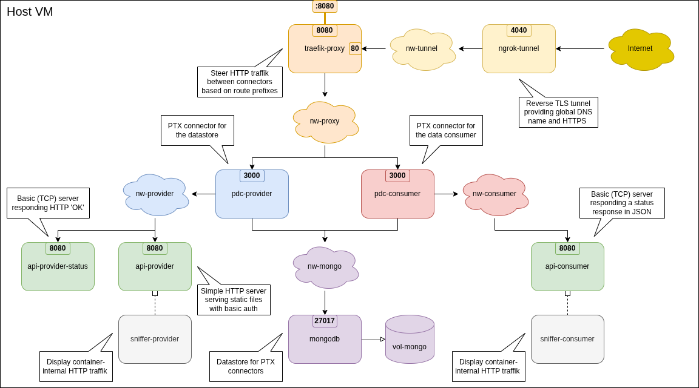

# Exchange Setup for Testing Data Exchanges via Vision's PTX Catalog

## Image Building

The [PTX dataspace connector](https://github.com/Prometheus-X-association/dataspace-connector) (PDC)
and HTTP packet sniffer images must be built beforehand as these are not available in remote repositories.

To build the required images, use the dedicated [Makefile](Makefile) target:

```bash
$ make build
```

## Infrastructure Setup

### Prerequisites

Data transfer in the PTX dataspace is orchestrated by VisionTrust's [catalog](https://visionstrust.com/), which requires
free registrations both for the data provider and the data consumer, separately.

Providing global access to the locally-managed PDC instances for the Vision catalog, a [ngrok](https://ngrok.com/)
reversed TLS proxy is configured, which also requires a free registration.

As a prerequisite, first copy the sample exchange config file ([creds/exchange.env.sample](creds/exchange.env.sample))
and provide the required parameters:

```bash
$ cp creds/exchange.env.sample creds/exchange.env 
```

Test exchange configuration can be given in the default `exchange.env` file (recommended)
or in a separate env file that is directly used by a `test_<...>.sh` script.

Mandatory variables, that need to be given:

- PDCs' **service** and **secret** keys that can be found (currently)
  [here](https://visionstrust.com/dashboard/profile/settings?tab=api).
- ngrok's **authentication token** and a fixed (dev) **domain name** that can be found (currently)
  [here](https://dashboard.ngrok.com/get-started/your-authtoken) and [here](https://dashboard.ngrok.com/domains).
- The signed **contract ID** , which consolidates and designates the test data exchange and its participants.
- The **offer IDs** of the designated data provider and data consumer participating in the contract.
- The exact **resource IDs** in the provider's data offer and the consumer's service offer participating in the test
  exchange.

Other setup configurations, such as exchange trigger keys or authentication secrets, can be also given here, which are
used by specific test cases or other test methods.

### Configuration

Dataspace components, i.e., PDC instances (provider and consumer), mongodb, and connected REST APIs, are configured
based on the PDC's [wiki](https://github.com/Prometheus-X-association/dataspace-connector/wiki) adn fixed for this
infrastructure setup.

Other infrastructure-related components, e.g., proxy, tunnel, etc., have a static configuration tailored to this setup
as well.

For the configuration details, check the infrastructure descriptor file [basic-infra.yaml](basic-infra.yaml),
specifically the inline config entries under the `configs:` key.

As an extension, packet sniffer containers can be directly attached to the APIs network stack to collect and display
HTTP traefik routed to the API containers. To initiate these extra components along with the API containers, use the
dedicated setup configuration by executing `make setup-all` and check the containers' output using `make logs`.

### Infrastructure

To set up the exchange infrastructure, simply use the target:

```bash
$ make setup
```

To only initiate basic infrastructure components without provider/consumer APIs, use the dedicated target:

```bash
$ make setup-base
```

To initiate packet sniffers and examine PDC --> API invocations, use the following target:

```bash
$ make setup-all
```

To check component status, use the following target:

```bash
$ make status
```

The container architecture, used networks, and communication patters are illustrated in the figure below.



The `traefik` (HTTP traffik steering) and `ngrok` (global HTTPS access) components also provides a web-based debug
interface for validating configuration and examining request-response pairs.

For security reasons, both interfaces are served via the traefik's dashboard port (**8080**) and can be accessed only
through a specific hostname bound to **localhost**.
However, the auxiliary port 8080 is not bound to any localhost IP, thus these interfaces can be accessed from
host machine in case the infrastructure is set up on a VM.
To access to ngrok's web interface on port **4040** directly, the relevant port expose setting should be uncommented
in the base setup file.

The following URLs can be used for accessing the web interfaces:

- Reverse tunneling (`ngrok-tunnel`): http://ngrok.exchange.localhost:8080
- HTTP request routing (`traefik-proxy`): http://traefik.exchange.localhost:8080

### Dataspace contract

To create data/service offers and resources, as well as negotiating and signing a contract for the test exchange, follow
the related steps in VisionTrust's [Documentation](https://docs.visionstrust.com/application/onboarding.html).

Infrastructure-related configurations in the resource descriptions are the following:

#### Data Resource Settings in the Datasource's Offer

Resource configuration defines the representation of the datasource's data-providing API.

- Source Type: `REST`
- URL: `http://api-provider:8080/dp0/data.csv`
- Query Parameters: _(optional, for testing purposes)_
    - `test` _(defined as a constant value `true` in the exchange request)_
    - `param` _(takes the dynamic value of epoch time)_
- Security: `API-key`
    - Credential identifier: `test-auth-basic` _(predefined in provider's PDC configuration)_
- Select MIME type: `text/csv` _(Testing non-JSON data format)_
- Input: `JSON` _(Back-propagated status info)_
- Output: `CSV` _(Provider API returns a CSV file)_
- "Is the data aimed to be an API payload ?" _(Consumer propagates back a status info)_
    - [x] Checked
    - Payload Representation: `REST`
    - URL: `http://api-provider-status:8080/<arbitrary_path>`
      _(Dedicated component for receiving the consumer's response)_

#### Service Resource Settings in the Consumer's Offer

Resource configuration defines the representation of the consumer's data-receiving API.

- Source Type: `REST`
- URL: `http://api-consumer:8080/<arbitrary_path>`
- Query Parameters: _(optional, for testing purposes)_
    - `test` _(takes the query value from a global consumer param in the exchange request)_
    - `param` _(omitted, no value is defined in the exchange request)_
- Security: `None` _(no authentication)_
- Input: `CSV` _(Provider API sends a CSV file)_
- Output: `JSON` _(Consumer API responds with a status info)_
- "Is the resource an API?": _(Status info is propagated back to the provider)_
    - [x] Checked

## Testing

Execute test using targets starts with `test-` (or directly with the helper scripts):

```bash
$ make test-config
$ make test-credential
$ make test-exchange
...
```

To see relevant logs, use the specific target:

```bash
$ make logs
```

## Tearing down

To tear down the infrastructure and delete intermediary files, use the following target:

```bash
$ make teardown
```

To redeploy the infrastructure, use the helper target (`teardown` + `setup`):

```bash
$ make restart
```