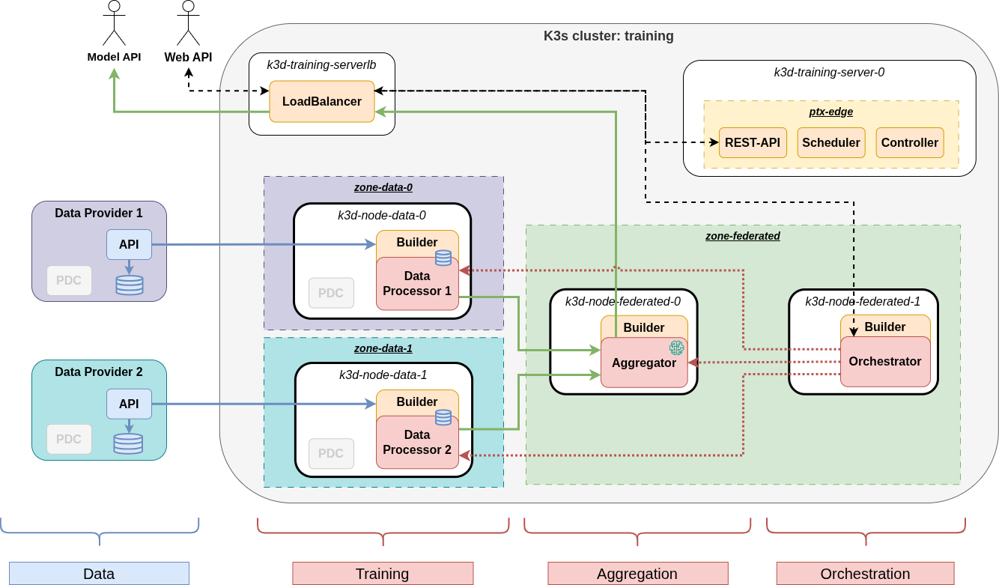
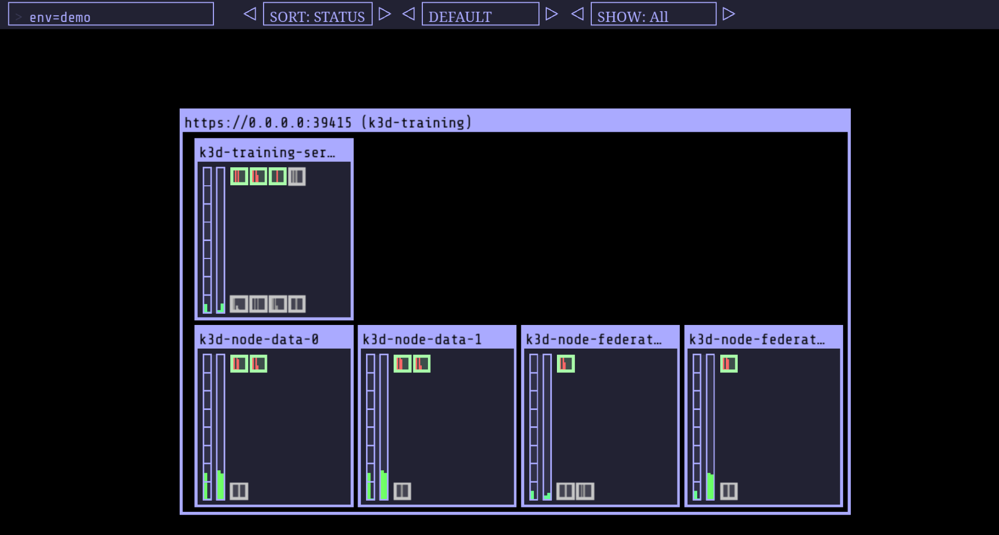

# Test Training Setup for Edge Federated Learning

The testing environment prepares and configures **an emulated edge Kubernetes (k8s) cluster** based on docker containers
with the capabilities of communicating with the [PTX dataspace](https://visionstrust.com/).

The figure below depicts the schematic architecture of the created infrastructure.

Each physical node is configured as a separate docker image playing the role of a cluster node.
The Edge computing building block (ptx-edge) is represented with standalone components distributed in these nodes.

- _k3d-training-server-0_: main control plane node running ptx-edge management components.
- _k3d-node-*_: worker nodes belonging to different privacy zones (data-0/1, and federated).

The currently supported training setup si the following:



## Dependencies

The setup script ([install_deps.sh](scripts/install_deps.sh)) installs required system packages and dependencies
for the following tools:

- `docker`: container manager
- `k3d`: managing local clusters with docker-in-docker based on the Kubernetes variant k3s
- `kubectl`: CLI tool for interacting with Kubernetes API
- `kubecolor`: colored logging for kubectl
- `helm`: Kubernetes package manager
- `skopeo`: local container inspection and handling
- `make`: for unified and simple setup, configuration, and execution management

The script is tested on Ubuntu 24.04.3 LTS with upgraded packages.

To prepare the environment, run the following command:

```bash
$ make depends
```

or directly the setup script:

```bash
$ ./install_deps.sh -u
```

For detailed configuration options, see `./install_deps.sh -h`

It is important to note that, as the warning log indicates at the end of the installation script,
the current shell session **must be reloaded** for the added docker group privilege to take effect!

For this reason, the user should run the `$ newgrp docker` command after successful installation!

## Setup

The following numbered `Makefile` targets execute the ptx-edge installation steps:

```bash
# Build ptx-edge components delivered in this project as separate docker images
# Build modified PDC connector for full Kubernetes (cloud-native) compatibility
# Builds sandbox elements (catalog, contract, consent) for local testing
$ make 0-build

# Configure and start the infrastructure topology
$ make 1-init

# Pull and initiate a graphical viewer tool for the Kubernetes cluster
$ make 2-viewer

# Setup ptx-edge extension in the emulated Kubernetes cluster
$ make 3-edge

# Initiate federated learning components
$ make 4-demo
```

To stop and remove installed setup components, use the following steps:

```bash
# Stop and delete demo setup
$ make stop-demo

# Remove ptx-edge components
$ make delete-edge

# Shut down cluster
$ make shutdown-cluster
```

Common steps are also grouped in dedicated high-level targets:

```bash
$ make setup    # Invoke 0-build -> 1-init -> 2-viewer -> 3-edge -> 4-demo, as a single setup step

$ make teardown # Invoke stop-demo -> delete-edge -> shutdown-cluster, as a single step
```

## Local development

For local development and testing, use the dedicated targets:

```bash
$ make local-setup  # Invoke 0-build -> 1-init -> 2-viewer -> 3-edge -> datasource-api -> 4-demo
```

This target initiates the local datasource API and use global envvars: `LOCAL_SETUP` and `USE_SANDBOX`
to configure local deployment in a VM with sandboxed PTX core components.

These global variables can/should be overwritten in scripts in `./creds` to enforce
local setup for numbered subscripts used by make.

## Further useful targets:

```bash
$ make status   # Print detailed info about deployed Kubernetes objects

$ make shell    # Initiate a shell in a simple pod within the cluster for testing purposes

$ make top      # Periodically poll resource usage of pods in worker tier

$ make log      # Display pod logs in worker tier continuously (4-demo)

$ make cleanup  # Remove all local container images 
```

## K8s Viewer

The deployed ptx-edge extension is depicted on the K8s viewer.


