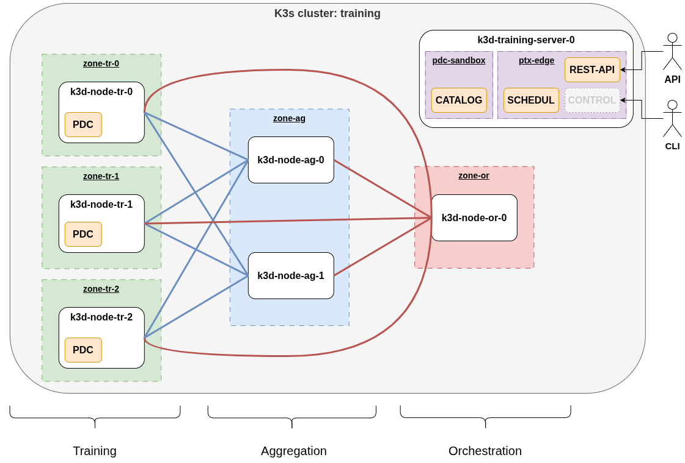
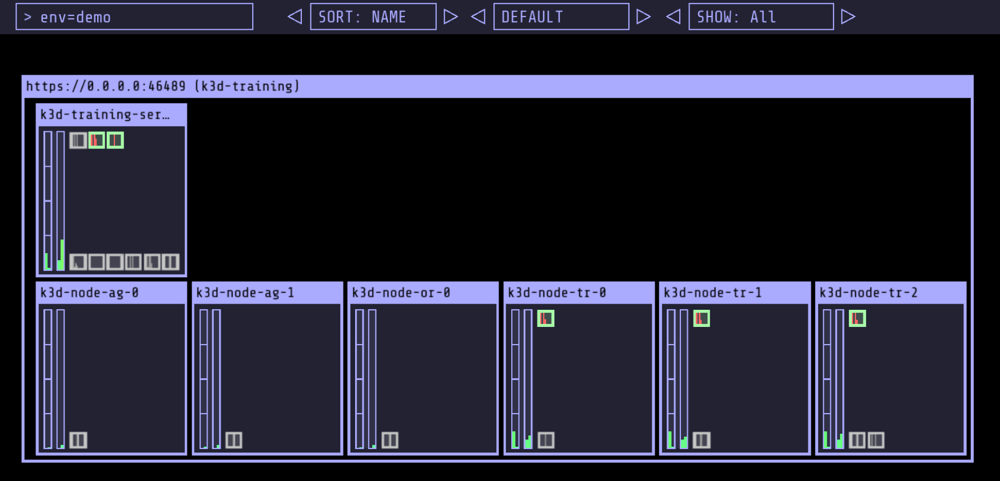

# Test Training Setup for Edge Federated Learning

The testing environment prepares and configures **an emulated edge Kubernetes (k8s) cluster** based on docker containers
with the capabilities of communicating with the [PTX dataspace](https://visionstrust.com/).

The figure below depicts the schematic architecture of the created infrastructure.

Each physical node is configured as a separate docker image playing the role of a cluster node.
The Edge computing building block (ptx-edge) is represented with standalone components distributed in these nodes.
 - k3d-training-server-0: main control plane node running ptx-edge management components.
 - k3d-node-*: worker nodes belonging to different privacy zones (TR-1/2/3, AG, and OR).



## Dependencies

The setup script ([install_deps.sh](install_deps.sh)) is tested on Ubuntu 24.04.3 LTS with upgraded packages.

The script installs required system packages and dependencies for the following tools:
 - `docker`: container manager
 - `k3d`: managing local clusters with docker-in-docker based on the Kubernetes variant k3s
 - `kubectl`: CLI tool for interacting with Kubernetes API
 - `kubecolor`: colored logging for kubectl
 - `helm`: Kubernetes package manager
 - `skopeo`: local container inspection and handling

To prepare the environment, run the following command:
```bash
$ ./install_deps.sh -u
```
or in case the tool `make` is already installed, simply use:
```bash
$ make depends
```

It is important to note that, as the warning log indicates at the end of the installation script,
the current shell session **must be reloaded** for the added docker group privilege to take effect!

For this reason, the user should run the `$ newgrp docker` command after successful installation!

## Setup

The following numbered `Makefile` targets execute the ptx-edge installation steps:

```bash
# Build ptx-edge components delivered in this project as separate docker images
# Build modified PDC connector for full Kubernetes (cloud-native) compatibility
# Builds sandbox elements (catalog, contract, consent) for local testing
$ make 0-build

# Configure and start the infrastructure topology
$ make 1-init

# Pull and initiate a graphical viewer tool for the Kubernetes cluster
$ make 2-viewer

# Setup ptx-edge extension in the emulated Kubernetes cluster
$ make 3-setup

#$ make 4-demo 

# Remove all ptx-edge extension components, leaves the infrastructure intact
$ make 5-delete

# Tear down emulated infrastructure and purge caches
$ make 6-shutdown
```

Common steps are also encompassed in dedicated targets:
```bash
$ make setup    # Invoke 0-build -> 1-init -> 2-viewer -> 3-setup, as a single step setup

$ make cleanup  # Invoke 5-delete -> 6-shutdown, as a single step tear down

$ make all      # Invoke all numbered targets continuously, as an all-in-one demonstration command
```

Further useful targets:
```bash
$ make status   # Print info about deployed Kubernetes objects

$ make clear    # Remove initiates and possibly failed tasks and related objects, leaving ptx-edge setup intact
```

## K8s Viewer

The deployed ptx-edge extension is depicted on the K8s viewer.


